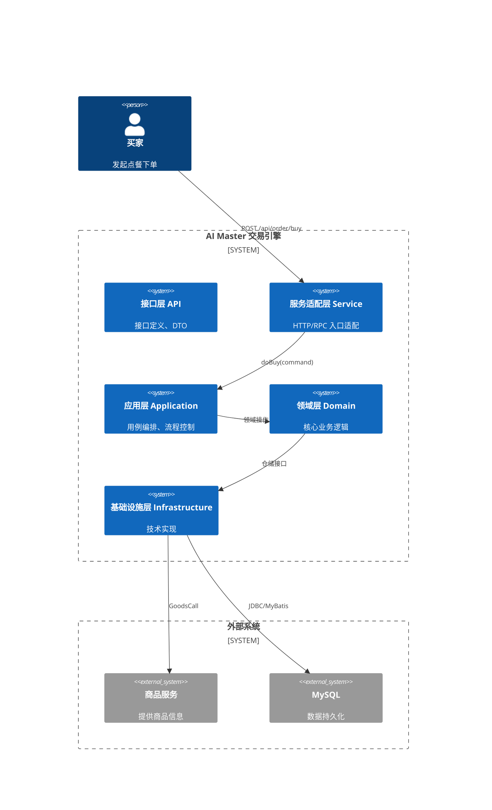
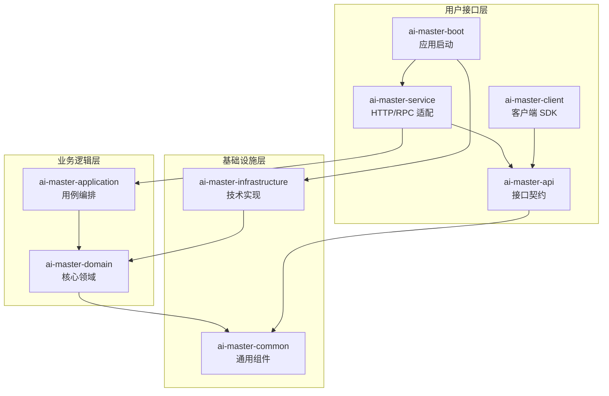
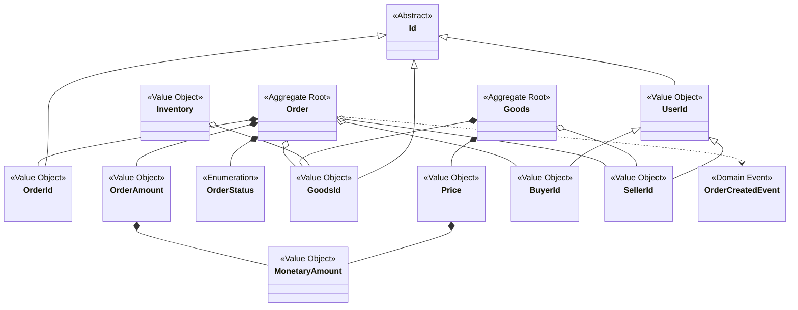
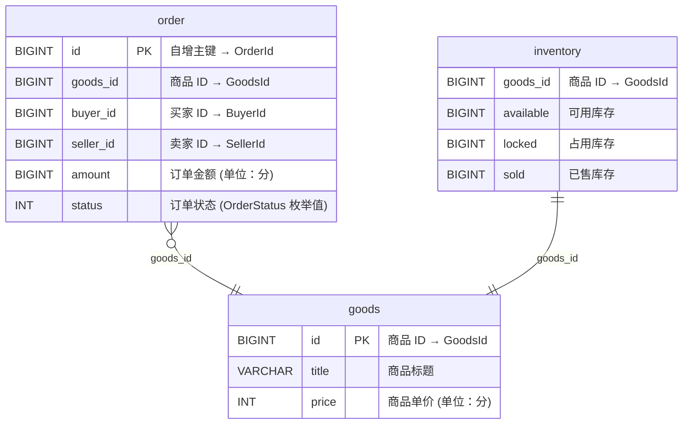
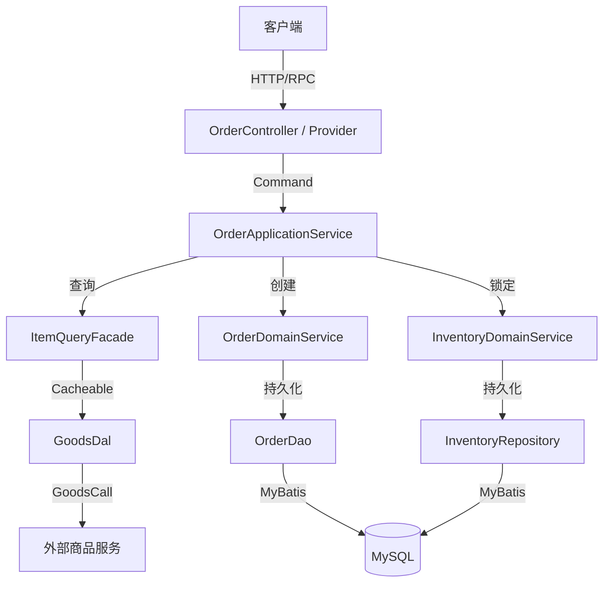
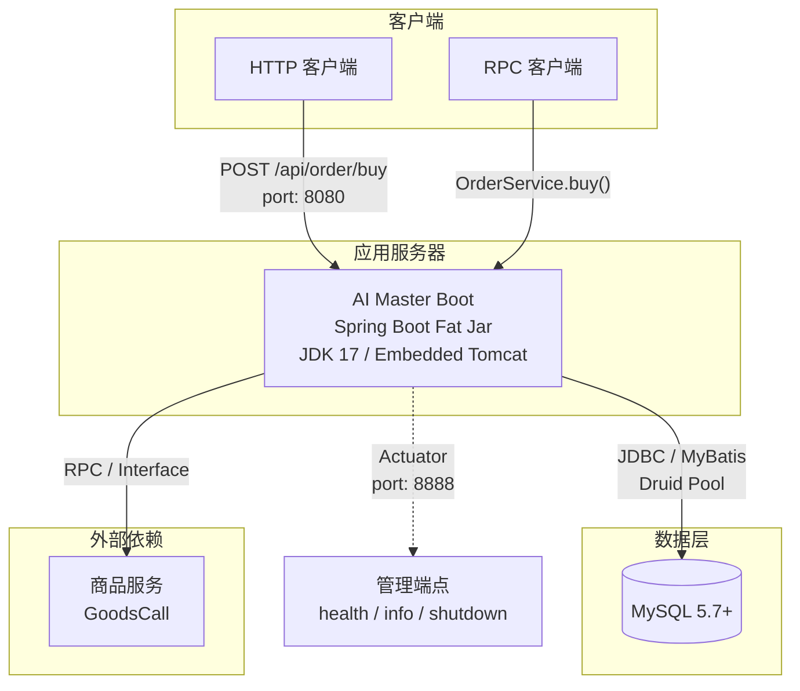

# 架构设计说明书 (ADD)

## 文档信息

| 属性 | 值 |
|------|-----|
| 版本 | 3.0 (结构化改进版) |
| 更新日期 | 2026-02-24 |

### 版本记录

| **版本号** | **修订时间** | **修订人** | **内容概述** |
|-----------|------------|----------|-------------|
| V1.0.0 | 2026-02-12 | System | N 新建逆向分析版本 |
| V2.0.0 | 2026-02-12 | System | M 增强业务分析、C4 架构图、数据架构 |
| V3.0.0 | 2026-02-24 | System | M 按标准模板重组章节；A 增加架构风格、分层图、UML 类图、核心组件表、API 清单、ER 图、部署图、文档约定 |

---

## 架构概述

### 架构风格

本系统采用 **DDD 六边形架构**（Hexagonal Architecture），结合整洁架构（Clean Architecture）和 CQRS 模式：

- **六边形架构**: 核心业务逻辑（Domain）与外部技术细节（Infrastructure）通过端口-适配器模式解耦
- **DDD 分层**: 严格遵循 API → Service → Application → Domain ← Infrastructure 的依赖方向
- **CQRS**: 命令（Command）与查询（Query/Facade）职责分离

### 架构图

> C4 Context 级别



### 分层架构



| 层级 | 模块 | 职责 | 关键组件 | 依赖方向 |
|------|------|------|----------|---------|
| **接口层** | `ai-master-api` | 服务契约定义 | `OrderService`, `OrderBuyRequest`, `OrderBuyResponse`, `OrderBuyDTO` | → common |
| **适配层** | `ai-master-service` | HTTP/RPC 入口 | `OrderController`, `OrderServiceProvider`, `OrderCommandFactory`, `OrderResultFactory` | → api, application |
| **应用层** | `ai-master-application` | 用例编排 | `OrderApplicationService`, `OrderCreateAction`, `InventoryLockAction`, `OrderEnableAction` | → domain |
| **领域层** | `ai-master-domain` | 核心业务 | `Order`, `Goods`, `Inventory`, `OrderDomainService`, `InventoryDomainService` | → common |
| **基础设施层** | `ai-master-infrastructure` | 技术实现 | `OrderDao`, `GoodsDal`, `OrderMapper`, `OrderFactory`, `GoodsFactory` | → domain |
| **启动层** | `ai-master-boot` | 应用启动 | `ApplicationStarter` (Jackson SNAKE_CASE 配置) | → service, infrastructure |

#### 系统职责边界

| 系统名称 | 主要职责 | 边界说明 |
|---------|---------|---------|
| 接口层 (api) | 定义服务契约 (接口 + DTO + Request/Response) | 不含任何实现逻辑 |
| 服务适配层 (service) | 接收外部请求，参数校验，DTO↔Command 转换 | 不含业务逻辑，仅协议适配 |
| 应用层 (application) | 用例编排，协调多个 Action 完成业务流程 | 不实现业务规则，只编排 |
| 领域层 (domain) | 核心业务逻辑，实体、值对象、领域服务 | 不依赖任何技术框架 (除 Spring 注解) |
| 基础设施层 (infrastructure) | 仓储实现、数据库访问、外部服务适配 | 实现领域层定义的接口 |

---

## 应用架构


### 领域模型

> UML 类图（仅类名，展示聚合与继承关系）



#### 领域对象

| 领域对象 | DDD 类型 | 职责 | 关键属性 |
|----------|---------|------|----------|
| `Order` | 聚合根 | 订单一致性边界，工厂创建+状态机 | orderId, goodsId, buyerId, sellerId, itemCount, amount, status |
| `Goods` | 聚合根 | 商品信息与价格计算 | goodsId, title, price, sellerId |
| `Inventory` | 值对象 | 库存管理（锁定/扣减/回退） | goodsId, available, locked, sold, lock |
| `OrderId` | 值对象 | 订单唯一标识 | id (Long, >0) |
| `OrderAmount` | 值对象 | 订单金额封装 | amount (MonetaryAmount) |
| `OrderStatus` | 枚举 | 订单状态机 (7种状态) | NEW→CREATED→PAID→... |
| `Price` | 值对象 | 商品单价，含溢出检查 | amount (MonetaryAmount) |
| `MonetaryAmount` | 值对象 | 不可变金额 (元/分双单位，支持折扣/加减) | monetaryAmount (BigDecimal), scale |
| `BuyerId`/`SellerId` | 值对象 | 用户标识 | 继承 UserId → Id |
| `OrderCreatedEvent` | 领域事件 | 订单创建事件（已定义未使用） | 继承 OrderEvent |

### 核心组件

| **组件名称** | **职责** | **位置** | **依赖** | **被依赖** |
|-------------|--------|---------|---------|-----------|
| `OrderController` | HTTP REST 入口，参数校验 | ai-master-service | `OrderApplicationService`, `OrderCommandFactory`, `OrderResultFactory` | 外部 HTTP 客户端 |
| `OrderServiceProvider` | RPC 入口，参数校验 | ai-master-service | `OrderApplicationService`, `OrderCommandFactory`, `OrderResultFactory` | 外部 RPC 客户端 |
| `OrderApplicationService` | 下单用例编排 | ai-master-application | `OrderCreateAction`, `InventoryLockAction`, `OrderEnableAction` | Controller, Provider |
| `OrderCreateAction` | 创建订单原子动作 | ai-master-application | `ItemQueryFacade`, `OrderDomainService` | `OrderApplicationService` |
| `InventoryLockAction` | 锁定库存原子动作 | ai-master-application | `InventoryDomainService` | `OrderApplicationService` |
| `OrderEnableAction` | 订单生效原子动作 | ai-master-application | `OrderDomainService` | `OrderApplicationService` |
| `OrderDomainService` | 订单领域操作（创建+生效持久化） | ai-master-domain | `OrderRepository` | Actions |
| `InventoryDomainService` | 库存锁定操作 | ai-master-domain | `InventoryRepository` | `InventoryLockAction` |
| `ItemQueryFacade` | 商品查询门面（含缓存） | ai-master-domain | `GoodsRepository` | `OrderCreateAction` |
| `OrderDao` | 订单仓储实现 | ai-master-infrastructure | `OrderMapper`, `OrderFactory` | `OrderDomainService` (via `OrderRepository`) |
| `GoodsDal` | 商品仓储实现 | ai-master-infrastructure | `GoodsCall`, `GoodsFactory` | `ItemQueryFacade` (via `GoodsRepository`) |

### API 清单

| 端点 | 方法 | 描述 | 请求体 | 响应体 | SLA | 状态 |
|------|------|------|--------|--------|-----|------|
| `POST /api/order/buy` | HTTP | 买家下单购买 | `OrderBuyRequest` {buyer_id, goods_id, item_count} | `OrderBuyResponse` {success, module: OrderBuyDTO} | @Call(elapsed=1200ms) | ✅ 已实现 |
| `OrderService.buy()` | RPC | 买家下单购买 | `OrderBuyRequest` {buyerId, goodsId, itemCount} | `OrderBuyResponse` | @Call(elapsed=1200ms) | ✅ 已实现 |
| 订单查询 | - | 查询订单详情 | orderId | Order 详情 | - | ⬜ 占位 |

#### 对象转换链

```
OrderBuyRequest (api)
    ↓ OrderCommandFactory.asCommand() [BeanHelper]
OrderBuyCommand (application)
    ↓ OrderApplicationService.doBuy()
Order (domain)
    ↓ OrderBuyResultFactory.toResult() [MapStruct]
OrderBuyResult (application)
    ↓ OrderBuyDTOFactory.toDTO() [MapStruct]
OrderBuyDTO (api)
    ↓ OrderBuyResponse.success(dto)
OrderBuyResponse (api)
```

---

## 数据架构

### 数据库选型

| 维度 | 选型 | 说明 |
|------|------|------|
| 数据库 | MySQL 5.7+ | 关系型数据库，存储订单交易数据 |
| 驱动 | mysql-connector-java 5.1.30 | 版本偏旧，建议升级到 8.x |
| 连接池 | Druid 1.2.23 | 阿里巴巴连接池，支持监控 |
| ORM | MyBatis 2.3.2 (starter) | XML/注解混合映射 |
| 配置 | `application.properties` + Spring profiles | `spring.profiles.active=dev` |

### 核心表结构

> 基于 `OrderEntity` 和 `GoodsEntity` 逆向推测



| 表名 | 实体 | 字段 | 类型 | 说明 |
|------|------|------|------|------|
| `order` | OrderEntity | id | BIGINT PK | 自增主键，映射为 OrderId |
| | | goods_id | BIGINT | 商品 ID |
| | | buyer_id | BIGINT | 买家 ID |
| | | seller_id | BIGINT | 卖家 ID |
| | | amount | BIGINT | 订单金额 (单位：分) |
| | | status | INT | 订单状态 (参见 OrderStatus 枚举) |
| `goods` | GoodsEntity | id | BIGINT PK | 商品 ID |
| | | title | VARCHAR | 商品标题 |
| | | price | INT | 商品单价 (单位：分) |
| `inventory` | (推测) | goods_id | BIGINT | 商品 ID |
| | | available | BIGINT | 可用库存 |
| | | locked | BIGINT | 占用库存 |
| | | sold | BIGINT | 已售库存 |

### 数据流图



---

## 技术架构
### 技术选型

| **VALET** | **考量维度** | **当前方案** | **备注** |
|-----------|------------|------------|---------|
| **Volume (容量)** | 并发流量 | Spring Boot 内嵌 Tomcat | 可水平扩展 |
| | 数据量 | MySQL 单库 | 需关注订单表增长 |
| **Availability (可用性)** | 可用率 | Spring Boot Fat Jar 部署 | 建议容器化+多实例 |
| **Latency (耗时)** | 请求 RT | 商品查询 @Cacheable, @Call 监控 | elapsed=1200ms 告警阈值 |
| | 数据读写 | MyBatis + Druid 连接池 | Druid 1.2.23 |
| **Error (错误率)** | 参数容错 | Bean Validation + 自定义 validator | 双重校验 (HTTP/RPC) |
| | 数据一致性 | 订单创建→库存锁定 (应用层编排) | 缺少分布式事务保障 |
| | 金额安全 | Long 溢出检查 (Price.calculateAmount) | MonetaryAmount 不可变 |
| **Ticket (运维)** | 监控 | Transformer @Call 注解 | 方法级日志与性能采样 |


### 集成点

| 外部系统 | 集成方式 | 接口 | 用途 |
|---------|---------|------|------|
| MySQL | JDBC / MyBatis | `OrderMapper.insert()` / `OrderMapper.enable()` | 订单数据持久化 |
| 商品服务 | RPC / Interface (`GoodsCall`) | `GoodsCall.getGoodsById()` | 商品信息获取 |
| Transformer | Jar 依赖 (v1.2.10) | `@Call`, `BeanHelper`, `Result`, `Request` | 通用框架支持 |

### 部署架构



| 部署项 | 说明 |
|--------|------|
| **构建** | Maven 多模块，`mvn clean package -DskipTests` |
| **运行** | `java -jar ai-master-boot/target/ai-master-boot.jar` |
| **环境** | JDK 17+, Maven 3.8+, MySQL 5.7+ |
| **配置** | `ai-master-boot/src/main/resources/application.properties` |
| **管理端口** | 8888 (Actuator: health, info, shutdown) |
| **进程管理** | PID 文件 `app.pid` |

---

## 详设文档映射

| 主流程编号 | 主流程名称 | 详细设计文档 |
|-----------|-----------|------------|
| 1 | 接收下单请求 | 参见 Service 层 `OrderController` / `OrderServiceProvider` |
| 2 | 交易处理 | 参见 Application 层 `OrderApplicationService.doBuy()` |
| 3 | 返回结果 | 参见 Service 层 `OrderResultFactory` / `OrderBuyDTOFactory` |

---

## 文档约定

- 架构图优先采用 **C4 模型**规范 (Context / Container / Component / Code)
- 领域模型优先采用 **UML** 规范 (类图、时序图、状态图)
- 数据模型优先采用 **ER 图**规范
- 所有图表采用 **mermaid** 协议，确保版本控制可追溯

---

## 参考文档

- 项目知识库: [AGENTS.md](../AGENTS.md)
- 产品需求: [docs/prd.md](prd.md)
- 测试设计: [docs/tdd.md](tdd.md)
- API 文档: [docs/api/README.md](api/README.md)
