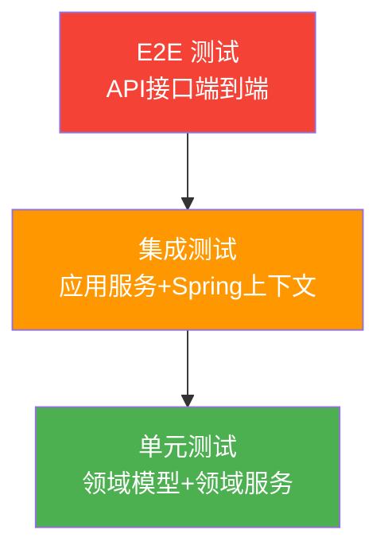

# 测试设计说明书 (TDD)

## 文档信息

| 属性 | 值 |
|------|-----|
| 版本 | 3.0 (结构化改进版) |
| 更新日期 | 2026-02-24 |

### 版本记录

| **版本号** | **修订时间** | **修订人** | **内容概述** |
|-----------|------------|----------|-------------|
| V1.0.0 | 2026-02-12 | System | N 新建逆向分析版本 |
| V2.0.0 | 2026-02-12 | System | M 增强测试用例至 43 条，补充代码示例 |
| V3.0.0 | 2026-02-24 | System | M 重组测试策略章节；A 增加高优先级测试目标、集成/E2E 用例、测试数据集、Maven 配置、CI/CD 参考 |

---

## 测试现状分析

### 现有测试覆盖

| 指标 | 当前值 | 目标值 |
|------|--------|--------|
| 单元测试文件数 | **0** | 15+ |
| 单元测试覆盖率 | **0%** | ≥80% |
| 集成测试 | **无** | 核心链路覆盖 |
| E2E测试 | **无** | 下单流程覆盖 |

### 测试框架

| 类型 | 框架 | 版本 | 配置位置 | 说明 |
|------|------|------|----------|------|
| 单元测试 | JUnit | 4.13.2 | `pom.xml` test scope | 标准 Java 测试框架 |
| Mock 工具 | Mockito | 4.11.0 | `pom.xml` test scope | 模拟对象行为 |
| 断言库 | AssertJ | (Spring Boot 内置) | 自动引入 | 流式断言风格 |
| 集成测试 | Spring Boot Test | (Spring Boot 内置) | `pom.xml` test scope | 启动 Spring 上下文 |
| 覆盖率 | Jacoco | 0.8.7 | 父 `pom.xml` plugin | 代码覆盖率报告 |
| 内存数据库 | H2 | (需引入) | `application-test.yml` | 集成测试数据源 |

#### Maven 测试依赖配置

```xml
<!-- pom.xml 测试依赖 -->
<dependency>
    <groupId>junit</groupId>
    <artifactId>junit</artifactId>
    <version>4.13.2</version>
    <scope>test</scope>
</dependency>
<dependency>
    <groupId>org.mockito</groupId>
    <artifactId>mockito-core</artifactId>
    <version>4.11.0</version>
    <scope>test</scope>
</dependency>
<dependency>
    <groupId>org.springframework.boot</groupId>
    <artifactId>spring-boot-starter-test</artifactId>
    <scope>test</scope>
</dependency>
<dependency>
    <groupId>com.h2database</groupId>
    <artifactId>h2</artifactId>
    <scope>test</scope>
</dependency>
```

---

## 测试策略

### 测试分层



| 层级 | 覆盖范围 | 优先级 | Mock 策略 | 数据源 |
|------|---------|--------|----------|--------|
| **单元测试** | 领域模型、值对象、领域服务 | **P0 最高** | 不 Mock 领域对象；Mock 仓储接口 | 内存数据 |
| **集成测试** | 应用服务、仓储实现 | P1 | Mock 外部服务 (GoodsCall) | H2 内存库 |
| **E2E 测试** | HTTP 接口完整链路 | P2 | Mock 外部服务 | H2 内存库 |

### 测试原则
- **FIRST**: Fast, Independent, Repeatable, Self-validating, Timely
- **AAA 模式**: Arrange (Given), Act (When), Assert (Then)
- **单一断言**: 每个测试方法验证一个行为
- **命名规范**: `should{ExpectedBehavior}When{Condition}`

### 单元测试

#### 高优先级测试目标

| 模块 | 测试重点 | 建议用例数 | 优先级 |
|------|----------|------------|--------|
| `Order` 聚合根 | 工厂创建、状态机流转、金额计算 | 4 | P0 |
| `OrderStatus` 枚举 | 状态流转合法性、枚举值校验 | 4 | P0 |
| `Price` 值对象 | 金额计算、溢出检查 | 3 | P0 |
| `MonetaryAmount` 值对象 | 元/分创建、折扣/加减运算、边界校验 | 8 | P0 |
| `Id` 抽象基类 | 有效/无效 ID 创建校验 | 4 | P0 |
| `Inventory` 值对象 | 锁定库存创建 | 1 | P0 |
| `OrderDomainService` | 订单创建+持久化、订单生效 | 2 | P0 |
| `InventoryDomainService` | 库存锁定成功/失败 | 2 | P0 |
| `OrderApplicationService` | 完整下单编排、库存失败分支 | 3 | P0 |
| `OrderCreateAction` / `InventoryLockAction` | 各 Action 单元行为 | 2 | P0 |

### 集成测试

#### 高优先级测试目标

| 模块 | 测试重点 | 建议用例数 | 优先级 |
|------|----------|------------|--------|
| `OrderDao` | 订单插入、生效更新、失败回滚 | 3 | P1 |
| `GoodsDal` | 商品查询与 Domain↔Entity 转换 | 1 | P1 |
| `OrderFactory` / `GoodsFactory` | Entity↔Domain 双向映射正确性 | 2 | P1 |
| `OrderApplicationService` (Spring) | 含真实仓储的完整下单链路 | 2 | P1 |

### E2E 测试

#### 高优先级测试目标

| 模块 | 测试重点 | 建议用例数 | 优先级 |
|------|----------|------------|--------|
| `POST /api/order/buy` | HTTP 正常下单、参数校验失败、SNAKE_CASE 序列化 | 3 | P2 |
| `OrderService.buy()` (RPC) | RPC 正常下单、参数校验失败 | 2 | P2 |

---

## 测试用例清单

### 一、领域层 (Domain Layer) - P0

#### 1.1 Order 聚合根

| 用例ID | 描述 | 前置条件 | 步骤 | 期望结果 | 覆盖规则 |
|--------|------|----------|------|----------|----------|
| TC-DOM-001 | 成功创建订单 | 有效 BuyerId, Goods(含Price), count=2 | `Order.create(buyerId, goods, 2)` | 状态=NEW, 金额=单价×2, goodsId/buyerId/sellerId 正确 | BR-002, BR-005 |
| TC-DOM-002 | 订单生效流转 | 订单状态 NEW | `order.enable()` | 状态变为 CREATED | BR-003 |
| TC-DOM-003 | 非法状态流转 | 订单状态 CREATED | `order.enable()` | 抛出 IllegalStateException | BR-003 |
| TC-DOM-004 | 空状态生效 | 订单 status=null | `order.enable()` | 抛出 IllegalStateException("status is null") | - |

```java
// TC-DOM-001 示例
@Test
public void shouldCreateOrderWithCorrectAmountAndStatus() {
    // Given
    BuyerId buyerId = BuyerId.create(100L);
    Price price = Price.create(1000); // 10.00 元
    Goods goods = new Goods(GoodsId.create(1L), "测试商品", price);

    // When
    Order order = Order.create(buyerId, goods, 3);

    // Then
    assertEquals(OrderStatus.NEW, order.getStatus());
    assertEquals(3000L, order.getAmount().value()); // 10.00 × 3 = 30.00 元 = 3000 分
    assertEquals(1L, order.getGoodsId().value());
    assertEquals(100L, order.getBuyerId().value());
}
```

#### 1.2 OrderStatus 枚举

| 用例ID | 描述 | 前置条件 | 步骤 | 期望结果 |
|--------|------|----------|------|----------|
| TC-DOM-005 | NEW 可流转为 CREATED | status=NEW | `NEW.create()` | 返回 CREATED |
| TC-DOM-006 | CREATED 不可调用 create | status=CREATED | `CREATED.create()` | 抛 IllegalStateException |
| TC-DOM-007 | PAID 不可调用 create | status=PAID | `PAID.create()` | 抛 IllegalStateException |
| TC-DOM-008 | 状态枚举值对应 | - | 遍历枚举 | NEW=0, CREATED=1, PAID=2, ... NONE=-1 |

#### 1.3 Price 值对象

| 用例ID | 描述 | 前置条件 | 步骤 | 期望结果 |
|--------|------|----------|------|----------|
| TC-DOM-009 | 正常金额计算 | price=1000分 | `price.calculateAmount(3)` | 3000 分 |
| TC-DOM-010 | 金额溢出检查 | price=Long.MAX_VALUE/2 分 | `price.calculateAmount(3)` | 抛 IllegalArgumentException("amount is overflow") |
| TC-DOM-011 | 单件计算 | price=500分 | `price.calculateAmount(1)` | 500 分 |

#### 1.4 MonetaryAmount 值对象

| 用例ID | 描述 | 前置条件 | 步骤 | 期望结果 |
|--------|------|----------|------|----------|
| TC-DOM-012 | 元创建金额 | amount=10.50 | `MonetaryAmount.create(10.50)` | getAmount()=10.50, getCent()=1050 |
| TC-DOM-013 | 分创建金额 | cent=1050 | `MonetaryAmount.create(1050L)` | getAmount()=10.50, getCent()=1050 |
| TC-DOM-014 | 负数金额校验 | amount=-1 | `MonetaryAmount.create(-1.0)` | 抛 IllegalArgumentException |
| TC-DOM-015 | 折扣计算 | amount=100元 | `.discount(0.88)` | 88.00 元 |
| TC-DOM-016 | 金额加法 | amount=100元 | `.add(50.0)` | 150.00 元 |
| TC-DOM-017 | 金额减法 | amount=100元 | `.subtract(30.0)` | 70.00 元 |
| TC-DOM-018 | 余额不足扣减 | amount=10元 | `.subtract(20.0)` | 抛 IllegalArgumentException("balance is not enough") |
| TC-DOM-019 | 格式化输出 | amount=88.88元 | `.format()` | "￥88.88" |

#### 1.5 Id 抽象基类

| 用例ID | 描述 | 前置条件 | 步骤 | 期望结果 |
|--------|------|----------|------|----------|
| TC-DOM-020 | 有效 ID 创建 | id=100 | `OrderId.create(100L)` | value()=100 |
| TC-DOM-021 | null ID 校验 | id=null | `OrderId.create(null)` | 抛 IllegalArgumentException("id is null") |
| TC-DOM-022 | 零值 ID 校验 | id=0 | `OrderId.create(0L)` | 抛 IllegalArgumentException("id must gt 0") |
| TC-DOM-023 | 负值 ID 校验 | id=-1 | `OrderId.create(-1L)` | 抛 IllegalArgumentException("id must gt 0") |

#### 1.6 Inventory 值对象

| 用例ID | 描述 | 前置条件 | 步骤 | 期望结果 |
|--------|------|----------|------|----------|
| TC-DOM-024 | 创建锁定库存 | goodsId=1, lock=5 | `Inventory.createLock(GoodsId.create(1L), 5)` | 对象创建成功，lock=5 |

#### 1.7 领域服务

| 用例ID | 描述 | 前置条件 | 步骤 | 期望结果 |
|--------|------|----------|------|----------|
| TC-DOM-025 | OrderDomainService.create 成功 | Mock OrderRepository | 调用 create(buyerId, goods, 2) | 返回 Order, 调用 repository.create 一次 |
| TC-DOM-026 | OrderDomainService.enable 成功 | Mock OrderRepository, order.status=NEW | 调用 enable(order) | 状态变 CREATED, 调用 repository.enable 一次 |
| TC-DOM-027 | InventoryDomainService.lock 成功 | Mock InventoryRepository 返回 true | 调用 lock(goodsId, 5) | 返回 true |
| TC-DOM-028 | InventoryDomainService.lock 失败 | Mock InventoryRepository 返回 false | 调用 lock(goodsId, 5) | 返回 false |

### 二、应用层 (Application Layer) - P0

#### 2.1 OrderApplicationService

| 用例ID | 描述 | 前置条件 | 步骤 | 期望结果 |
|--------|------|----------|------|----------|
| TC-APP-001 | 完整下单流程-成功 | Mock: Goods存在, 库存锁定成功 | `doBuy(command)` | 订单创建成功, status=CREATED, 金额正确 |
| TC-APP-002 | 库存锁定失败 | Mock: Goods存在, 库存锁定返回false | `doBuy(command)` | 订单创建成功但 status=NEW (未生效) |
| TC-APP-003 | 结果映射正确 | Mock: 完整flow | `doBuy(command)` | OrderBuyResult 各字段与 Order 一致 |

```java
// TC-APP-001 示例
@RunWith(MockitoJUnitRunner.class)
public class OrderApplicationServiceTest {
    @Mock private InventoryLockAction inventoryLockAction;
    @Mock private OrderCreateAction orderCreateAction;
    @Mock private OrderEnableAction orderEnableAction;
    @InjectMocks private OrderApplicationService service;

    @Test
    public void shouldCreateOrderAndEnableWhenInventoryLocked() {
        // Given
        OrderBuyCommand command = new OrderBuyCommand();
        command.setBuyerId(100L);
        command.setGoodsId(1L);
        command.setItemCount(2);

        Order mockOrder = createMockOrder(OrderStatus.NEW);
        when(orderCreateAction.create(command)).thenReturn(mockOrder);
        when(inventoryLockAction.lock(mockOrder)).thenReturn(true);

        // When
        OrderBuyResult result = service.doBuy(command);

        // Then
        verify(orderCreateAction).create(command);
        verify(inventoryLockAction).lock(mockOrder);
        verify(orderEnableAction).enable(mockOrder);
    }
}
```

#### 2.2 OrderCreateAction

| 用例ID | 描述 | 前置条件 | 步骤 | 期望结果 |
|--------|------|----------|------|----------|
| TC-APP-004 | 创建订单动作 | Mock ItemQueryFacade 返回 Goods | `create(command)` | 调用 itemQueryFacade + orderDomainService.create |

#### 2.3 InventoryLockAction

| 用例ID | 描述 | 前置条件 | 步骤 | 期望结果 |
|--------|------|----------|------|----------|
| TC-APP-005 | 锁定库存动作 | Mock InventoryDomainService 返回 true | `lock(order)` | 调用 inventoryDomainService.lock(goodsId, itemCount) |

### 三、集成测试 (Integration Test) - P1

#### 3.1 OrderDao (仓储集成)

| 用例ID | 描述 | 前置条件 | 步骤 | 期望结果 |
|--------|------|----------|------|----------|
| TC-INT-001 | 创建订单持久化 | H2 内存库，schema 已初始化 | `create(order)` | order.orderId 被设置，DB 中有记录 |
| TC-INT-002 | 订单生效更新 | 订单已存在于 DB | `enable(order)` | 返回 true，DB status 由 0→1 |
| TC-INT-003 | 订单生效失败 | 订单不存在 | `enable(order)` | 抛 IllegalStateException |

#### 3.2 GoodsDal (外部服务集成)

| 用例ID | 描述 | 前置条件 | 步骤 | 期望结果 |
|--------|------|----------|------|----------|
| TC-INT-004 | 商品查询与转换 | Mock GoodsCall 返回 GoodsEntity | `acquireGoods(1L)` | 返回 Goods 领域对象，字段映射正确 |

#### 3.3 工厂类 (Domain↔Entity 映射)

| 用例ID | 描述 | 前置条件 | 步骤 | 期望结果 |
|--------|------|----------|------|----------|
| TC-INT-005 | OrderFactory 转换 | 有效 Order 对象 | `OrderFactory.instance(order)` | OrderEntity 各字段对应正确 |
| TC-INT-006 | GoodsFactory 转换 | 有效 GoodsEntity | `GoodsFactory.valueOf(entity)` | Goods 各字段正确，Price 正确创建 |

#### 3.4 完整下单链路 (Spring Context)

| 用例ID | 描述 | 前置条件 | 步骤 | 期望结果 |
|--------|------|----------|------|----------|
| TC-INT-007 | 完整下单成功 | H2 内存库 + Mock GoodsCall + Mock InventoryRepository | `doBuy(command)` | 订单持久化到 DB，状态=CREATED |
| TC-INT-008 | 下单库存不足 | H2 内存库 + Mock InventoryRepository 返回 false | `doBuy(command)` | 订单持久化到 DB，状态=NEW |

```java
// TC-INT-007 示例
@RunWith(SpringRunner.class)
@SpringBootTest
@Transactional
public class OrderFlowIntegrationTest {
    @Autowired
    private OrderApplicationService orderApplicationService;
    @MockBean
    private GoodsCall goodsCall;
    @MockBean
    private InventoryRepository inventoryRepository;

    @Test
    public void shouldCreateOrderAndEnableWhenFullFlowSucceeds() {
        // Given
        GoodsEntity goodsEntity = new GoodsEntity();
        goodsEntity.setId(1L);
        goodsEntity.setTitle("宫保鸡丁");
        goodsEntity.setPrice(2800);
        when(goodsCall.getGoodsById(1L)).thenReturn(goodsEntity);
        when(inventoryRepository.lock(any())).thenReturn(true);

        OrderBuyCommand command = new OrderBuyCommand();
        command.setBuyerId(100L);
        command.setGoodsId(1L);
        command.setItemCount(2);

        // When
        OrderBuyResult result = orderApplicationService.doBuy(command);

        // Then
        assertNotNull(result);
        verify(inventoryRepository).lock(any());
    }
}
```

### 四、E2E 测试 (End-to-End) - P2

#### 4.1 HTTP 接口

| 用例ID | 描述 | 前置条件 | 步骤 | 期望结果 |
|--------|------|----------|------|----------|
| TC-E2E-001 | HTTP 下单成功 | MockMvc + Mock 依赖 | POST `/api/order/buy` {buyer_id:100, goods_id:1, item_count:2} | 200 OK, `{"success":true}` |
| TC-E2E-002 | HTTP 参数缺失 | MockMvc | POST `/api/order/buy` {} | 200 OK, `{"success":false, "code":"PARAM_ERROR"}` |
| TC-E2E-003 | HTTP SNAKE_CASE 序列化 | MockMvc + Mock 依赖 | POST `/api/order/buy` (SNAKE_CASE 字段) | 响应字段采用 snake_case 命名 |

```java
// TC-E2E-001 示例
@RunWith(SpringRunner.class)
@SpringBootTest
@AutoConfigureMockMvc
public class OrderControllerE2ETest {
    @Autowired
    private MockMvc mockMvc;
    @MockBean
    private OrderApplicationService orderApplicationService;

    @Test
    public void shouldReturnSuccessWhenValidRequest() throws Exception {
        // Given
        OrderBuyResult mockResult = new OrderBuyResult();
        when(orderApplicationService.doBuy(any())).thenReturn(mockResult);

        String requestJson = "{\"buyer_id\":100,\"goods_id\":1,\"item_count\":2}";

        // When & Then
        mockMvc.perform(post("/api/order/buy")
                .contentType(MediaType.APPLICATION_JSON)
                .content(requestJson))
            .andExpect(status().isOk())
            .andExpect(jsonPath("$.success").value(true));
    }

    @Test
    public void shouldReturnParamErrorWhenMissingFields() throws Exception {
        // When & Then
        mockMvc.perform(post("/api/order/buy")
                .contentType(MediaType.APPLICATION_JSON)
                .content("{}"))
            .andExpect(status().isOk())
            .andExpect(jsonPath("$.success").value(false))
            .andExpect(jsonPath("$.code").value("PARAM_ERROR"));
    }
}
```

#### 4.2 RPC 接口

| 用例ID | 描述 | 前置条件 | 步骤 | 期望结果 |
|--------|------|----------|------|----------|
| TC-E2E-004 | RPC 下单成功 | Mock ApplicationService | `buy(validRequest)` | success=true |
| TC-E2E-005 | RPC 参数校验失败 | buyerId=null | `buy(invalidRequest)` | success=false, code=PARAM_ERROR |

## 测试用例统计

| 层级 | 用例数 | 优先级 | 覆盖目标 |
|------|--------|--------|---------|
| 领域层 (Domain) | **28** | P0 | Order, OrderStatus, Price, MonetaryAmount, Id, Inventory, 领域服务 |
| 应用层 (Application) | **5** | P0 | OrderApplicationService, Actions |
| 集成测试 (Integration) | **8** | P1 | OrderDao, GoodsDal, Factory, 完整链路 |
| E2E 测试 (End-to-End) | **5** | P2 | HTTP Controller, RPC Provider |
| **合计** | **46** | - | - |

## 测试数据

### 测试数据集

#### 基础标识 ID

| 变量 | 值 | 用途 |
|------|-----|------|
| `VALID_BUYER_ID` | 100L | 有效买家 ID |
| `VALID_SELLER_ID` | 200L | 有效卖家 ID |
| `VALID_GOODS_ID` | 1L | 有效商品 ID |
| `INVALID_ID` | -1L | 非法 ID (触发校验异常) |
| `ZERO_ID` | 0L | 零值 ID (触发校验异常) |
| `NULL_ID` | null | 空 ID (触发校验异常) |

#### 商品与价格

| 变量 | 值 | 说明 |
|------|-----|------|
| `GOODS_TITLE` | "宫保鸡丁" | 测试商品标题 |
| `GOODS_PRICE_CENT` | 2800 | 商品单价 28.00 元 (单位：分) |
| `GOODS_PRICE_YUAN` | 28.00 | 商品单价 (单位：元) |
| `ITEM_COUNT` | 2 | 购买件数 |
| `EXPECTED_AMOUNT_CENT` | 5600L | 预期订单金额 2800×2=5600 分 |
| `OVERFLOW_PRICE` | Long.MAX_VALUE / 2 | 触发溢出检查的价格 |

#### 金额运算

| 变量 | 值 | 说明 |
|------|-----|------|
| `AMOUNT_100_YUAN` | 100.00 | MonetaryAmount 基准金额 |
| `AMOUNT_100_CENT` | 10000L | 100 元 = 10000 分 |
| `DISCOUNT_88` | 0.88 | 八八折 |
| `EXPECTED_DISCOUNT` | 88.00 | 折后金额 |
| `ADD_AMOUNT` | 50.00 | 加法操作数 |
| `SUBTRACT_AMOUNT` | 30.00 | 减法操作数 |
| `INSUFFICIENT_SUBTRACT` | 200.00 | 余额不足扣减 (触发异常) |

#### 库存

| 变量 | 值 | 说明 |
|------|-----|------|
| `LOCK_COUNT` | 5 | 库存锁定数量 |
| `INVENTORY_LOCKED_TRUE` | true | 库存锁定成功 |
| `INVENTORY_LOCKED_FALSE` | false | 库存锁定失败 |

#### HTTP 请求

| 场景 | 请求体 JSON |
|------|------------|
| 正常下单 | `{"buyer_id":100,"goods_id":1,"item_count":2}` |
| 缺少买家 | `{"goods_id":1,"item_count":2}` |
| 缺少商品 | `{"buyer_id":100,"item_count":2}` |
| 数量为零 | `{"buyer_id":100,"goods_id":1,"item_count":0}` |
| 空请求体 | `{}` |

### Mock 策略

| 依赖类型 | 单元测试 | 集成测试 | E2E 测试 |
|---------|---------|---------|---------|
| 领域对象 | **不 Mock**，使用真实对象 | 不 Mock | 不 Mock |
| 仓储接口 | Mock (Mockito `@Mock`) | 使用 H2 内存库 | 使用 H2 内存库 |
| 外部服务 (GoodsCall) | Mock | Mock (`@MockBean`) | Mock (`@MockBean`) |
| 领域服务 | 视情况 Mock | 不 Mock | 不 Mock |
| ApplicationService | - | - | Mock (`@MockBean`) 或真实 |

### 测试数据库配置

```yaml
# application-test.yml
spring:
  datasource:
    url: jdbc:h2:mem:testdb;DB_CLOSE_DELAY=-1;DB_CLOSE_ON_EXIT=FALSE
    driver-class-name: org.h2.Driver
    username: sa
    password:
```

```sql
-- schema-test.sql (H2 初始化)
CREATE TABLE IF NOT EXISTS `order` (
    id BIGINT AUTO_INCREMENT PRIMARY KEY,
    goods_id BIGINT NOT NULL,
    buyer_id BIGINT NOT NULL,
    seller_id BIGINT NOT NULL,
    amount BIGINT NOT NULL,
    status INT NOT NULL DEFAULT 0
);
```

## 测试执行

### 命令

```bash
# 单元测试
mvn test -Dtest=*Test -pl ai-master-domain

# 应用层测试
mvn test -Dtest=*Test -pl ai-master-application

# 全量测试
mvn test

# 覆盖率报告
mvn test jacoco:report
```

### 质量门禁

| 指标 | 阈值 | 检查工具 |
|------|------|----------|
| 单元测试覆盖率 | ≥80% | Jacoco |
| 代码重复率 | ≤5% | PMD/CPD |
| 严重漏洞 | 0 | SonarQube |
| 编译警告 | 0 | Maven/Compiler |
| 代码风格违规 | ≤10 | Checkstyle |

### Jacoco 覆盖率配置

```xml
<!-- 父 pom.xml 插件配置 -->
<plugin>
    <groupId>org.jacoco</groupId>
    <artifactId>jacoco-maven-plugin</artifactId>
    <version>0.8.7</version>
    <configuration>
        <excludes>
            <exclude>**/*Application.class</exclude>
            <exclude>**/*Config.class</exclude>
            <exclude>**/*Entity.class</exclude>
        </excludes>
    </configuration>
    <executions>
        <execution>
            <goals>
                <goal>prepare-agent</goal>
            </goals>
        </execution>
        <execution>
            <id>report</id>
            <phase>test</phase>
            <goals>
                <goal>report</goal>
            </goals>
        </execution>
    </executions>
</plugin>
```

### CI/CD 集成参考

```yaml
# .github/workflows/test.yml
name: Test
on: [push, pull_request]
jobs:
  test:
    runs-on: ubuntu-latest
    steps:
      - uses: actions/checkout@v3
      - name: Set up JDK 17
        uses: actions/setup-java@v3
        with:
          java-version: '17'
          distribution: 'temurin'
      - name: Run tests
        run: mvn clean test
      - name: Generate coverage report
        run: mvn jacoco:report
      - name: Upload coverage
        uses: codecov/codecov-action@v3
```

---

## 参考文档

- 测试规范: `~/ai/rules/testing/testing-guidelines.md`
- 产品需求: [docs/prd.md](prd.md)
- 架构设计: [docs/add.md](add.md)
- 项目知识库: [AGENTS.md](../AGENTS.md)
